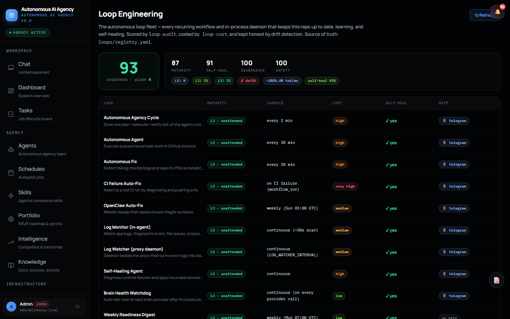

<div align="center">

# Autonomous AI Agency

**Paste your website URL. Get a CTO-grade audit in minutes.
Then let the agency that produced it go to work — on your infrastructure.**

Self-hosted · MIT · Your servers, your models, your data

[](https://github.com/strikersam/autonomous-ai-agency/releases/tag/v5.0.0)
[](https://github.com/strikersam/autonomous-ai-agency/actions/workflows/ci.yml)
[](https://github.com/strikersam/autonomous-ai-agency/actions/workflows/deploy-backend.yml)
[](https://www.python.org/)
[](LICENSE)

**[Try it live — free sandbox, resets every 24h](https://autonomous-ai-agency.strikersam.workers.dev/) · [See the proof](proof/README.md) · [Need assistance?](#need-assistance)**

</div>

---

## Don't trust it — check the proof

Most "autonomous agent" projects show you a demo video. Here are artifacts instead:

| Proof | What it shows |
|---|---|
| [**This repo is maintained by its own agents**](proof/agent-built.md) | **184 of the 642 merged pull requests** in this repository were opened by the agent fleet — self-healing systems, provider failover, CI hardening, releases. Not a demo: the public commit history, verifiable with one GitHub search. |
| [**Real audit output**](proof/audits/) | The SEO/GEO/AIO audit engine run against this project's own site — findings, scores, and the agent delegation plan, committed unedited (yes, including our own imperfect score). |
| [**24-hour live sandbox**](https://autonomous-ai-agency.strikersam.workers.dev/) | Onboard any site, watch specialists get provisioned, talk to the CEO agent. The environment resets every 24 hours. No signup wall, nothing to uninstall. |

---

## What it is

Autonomous AI Agency is a **self-hosted platform that turns one website URL into a working AI operations team**. It scans your site's tech stack, provisions the specialist agents your business actually needs (from 35 families), and runs them 24x7 on hardware you control — with human approval gates on anything that ships. Under the hood: an OpenAI-compatible proxy, multi-provider model routing with automatic failover, a three-role plan → execute → verify agent loop, and full observability. MIT licensed.

This page is the short version — the full tour (every screen, schedule, runtime, and config variable) lives in [**docs/platform-guide.md**](docs/platform-guide.md).

## Start with the audit — no signup, no repo access, no trust required

The entry point is deliberately the lowest-risk thing an agency can do: **read-only analysis**.

- **102 deterministic checks** across six pillars: Technical SEO, Content, Security headers, Social, **GEO** (generative-engine optimization: llms.txt, AI-crawler access, citable anchors) and **AIO** (answer-engine optimization: JSON-LD structured data, E-E-A-T markup)
- **0–100 health score**, overall and per pillar
- **Revenue-at-risk quantification** — pass your monthly organic revenue and every finding is priced (a clearly-labeled model estimate, never a fabricated loss)
- **Screaming Frog-compatible CSV exports** — drops into existing SEO workflows
- **Repo-aware auto-fix** — connect a repo later and the agent proposes dry-run diffs for fixable findings (`apply=true` writes them)
- **An agent-ready delegation plan** — every finding comes back as a WSJF-prioritized work package assigned to a specialist. That's the handoff from "audit" to "agency."

```bash
# Self-hosted, from a clone:
pip install -r requirements.txt
PYTHONPATH=. python scripts/run_seo_audit.py --website-url https://yourcompany.com --output-dir ./my-audit
```

Engine docs: [docs/seo-audit.md](docs/seo-audit.md) · Example output: [proof/audits/](proof/audits/)

## Then the agency takes over — at your pace

Trust is granted in steps, never all at once:

1. **Read-only** — audits, uptime/TLS monitoring, stack-drift detection, CVE scans. Zero write access.
2. **Dry-run** — agents propose diffs, draft PRs, draft replies. You read everything before it exists anywhere real.
3. **Gated writes** — agents open PRs, update docs, triage tickets. Nothing merges, deploys, or messages externally without your explicit approval. High-stakes actions always pause; you choose which low-risk classes of work to auto-approve.

After onboarding, the standing schedules run themselves: website health every 30 minutes, security audit daily, stack-change detection daily, code-quality scan daily, trend watch every 6 hours, docs sync on every push. You talk to a CEO agent in plain English ("fix the memory leak in issue #142"); it decomposes the job, delegates to the right specialist, and returns results with evidence — PR link, test output, reasoning trace.

Full roster, screens, loop engineering, and configuration: [docs/platform-guide.md](docs/platform-guide.md).

## Honest model economics

- The **free 24h sandbox** runs on free-tier models (Cerebras, Groq, NVIDIA NIM) with automatic failover. It demonstrates the orchestration loop end to end; it is *not* the output quality you'd run a company on.
- **Production runs on your infrastructure with your keys.** Anthropic Claude, OpenAI-compatible endpoints, AWS Bedrock, NVIDIA NIM, Groq, Cerebras, DeepSeek, and local Ollama are all supported by the same router — point the brain at a top-tier model from the Providers screen and every specialist upgrades instantly, no redeploy.
- **No data leaves your server.** No cloud relay, no usage telemetry, no shared inference endpoint, no per-seat pricing.

## Need assistance?

The software is free and always will be (MIT). If you'd like a hand putting it to work — or advice on AI adoption in general — I'm happy to assist.

> I built this platform end-to-end: multi-provider LLM routing with failover, multi-agent orchestration, human-approval workflows, observability, and a CI pipeline where the agents themselves ship the code ([proof](proof/agent-built.md)). I consult on AI strategy and agentic automation, and I can assist with deploying this platform on your own infrastructure with top-tier models (Claude, GPT — all supported), onboarding your company, and tuning the specialist fleet to your stack. A hands-on 2-week pilot is the usual starting point; early design partners get generous terms in exchange for a public case study.

- 📧 **strikersam@gmail.com** — tell me your URL and what you'd like automated first
- 📋 [**Request a pilot / ask a question**](https://github.com/strikersam/autonomous-ai-agency/issues/new?template=pilot-request.yml) — public form, answered within 48 hours
- Or simply [run the audit on your own site](#start-with-the-audit--no-signup-no-repo-access-no-trust-required) and send me the report — I'll walk you through what the fleet would do about it, free.

## Setup (self-hosted)

Python 3.13+, Node 20+, and either [Ollama](https://ollama.com/) or a free [NVIDIA NIM](https://build.nvidia.com/) API key. No Kubernetes, no cloud account — SQLite mode needs no database server at all.

```bash
git clone https://github.com/strikersam/autonomous-ai-agency.git && cd autonomous-ai-agency
python -m venv .venv && source .venv/bin/activate
pip install -r backend/requirements.txt
cp .env.example .env    # minimum: STORAGE_BACKEND=sqlite, SECRET_KEY, ADMIN_EMAIL/PASSWORD, NVIDIA_API_KEY
uvicorn backend.server:app --host 0.0.0.0 --port 8001
cd frontend && npm install && REACT_APP_BACKEND_URL=http://localhost:8001 npm start
```

Then open http://localhost:3000, paste your company URL, and onboard. Full setup, cloud deployment (Render + Cloudflare + GitHub Pages), and every configuration variable: [docs/platform-guide.md](docs/platform-guide.md#setup) · [docs/configuration-reference.md](docs/configuration-reference.md)

---

## Screens

> Captured from a live deployment. Regenerate with `python scripts/capture_screens.py`, then `python scripts/sync_readme_gallery.py`.

<!-- README_UI_GALLERY:START -->
### 💬 Chat — unified assistant

Talk to the CEO agent directly; it decomposes goals and routes work to the right specialists.

<p align="center"></p>

### 📊 Dashboard — system overview

Live agent health, recent activity, and system metrics at a glance.

<p align="center"></p>

### 🗂 Tasks — job lifecycle board

Every AI job made visible: waiting, running, blocked, in review, or done.

<p align="center"></p>

### 🤖 Agents — autonomous team

Your specialist roster — each with its own model, runtime, specialty, and guardrails.

<p align="center"></p>

### 🗓 Schedules — autopilot jobs

Recurring and scheduled autonomous work.

<p align="center"></p>

### ⚡ Skills — agentic capabilities

Reusable runtime skills bound to specialists.

<p align="center"></p>

### 🎯 Portfolio — WSJF roadmap

Prioritised initiatives, sprints, and agile health.

<p align="center"></p>

### 📈 Intelligence — trends & competitors

Trend and competitor signals scoped to each onboarded company's stack.

<p align="center"></p>

### 📚 Knowledge — docs & sources

Wiki pages, source material, and reusable context — your team's memory.

<p align="center"></p>

### 🔌 Providers — models, Ollama & MCP

Connect free/cloud/local AI sources and choose which models are available.

<p align="center"></p>

### 🔭 Logs — traces & observability

Every LLM call: tokens, latency, cost, and decision context.

<p align="center"></p>

### 🐙 GitHub — repos & PRs

Connect repositories and manage the agent's delivery surface.

<p align="center"></p>

### 🏢 Company — operating context

An onboarded company's detected stack, systems, and SEO/health.

<p align="center"></p>

### ✨ Onboarding — setup wizard

Scan a website and stand up its specialist agency in minutes.

<p align="center"></p>

### 🔁 Loops — autonomous fleet

Every autonomous loop catalogued: readiness score, maturity, self-heal coverage, drift status, and cost estimate.

<p align="center"></p>

### 🩺 Doctor — diagnostics

System self-checks and autonomy readiness probes.

<p align="center"></p>

### 🛡 Admin — users & access

Manage users, roles, instance activation, and onboarding gates.

<p align="center"></p>

### 📱 Mobile

Responsive layout — sign in, view the dashboard, and work the task board from a phone.

<p align="center">
  
  &nbsp;
  
  &nbsp;
  
</p>
<!-- README_UI_GALLERY:END -->

---

## Architecture, security, license

The stack is a React SPA (Cloudflare Worker / GitHub Pages) over a FastAPI backend (Render / Docker) with swappable MongoDB/SQLite storage, a ModelRouter for task-aware model selection, and a persisted workflow state machine with HITL gates — the full diagram and the honest feature-maturity matrix are in [docs/platform-guide.md](docs/platform-guide.md#architecture).

Security posture: no secrets in source (env-only, validated at startup) · JWT Bearer auth on every endpoint · three-role RBAC · per-task git worktree isolation · Bandit SAST + CodeQL + secret scanning on every push · dependency CVE audit on every PR · audit log for all admin actions.

MIT — see [LICENSE](LICENSE)

---

<div align="center">

**Autonomous AI Agency** — the AI team that works while you sleep, on a server you own.

<sub>Built for engineers and operators who want the leverage of frontier AI without the cloud bill, the privacy compromise, or the headcount.</sub>

</div>
