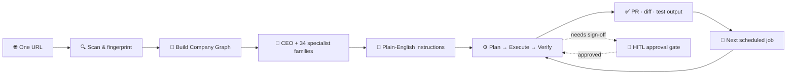
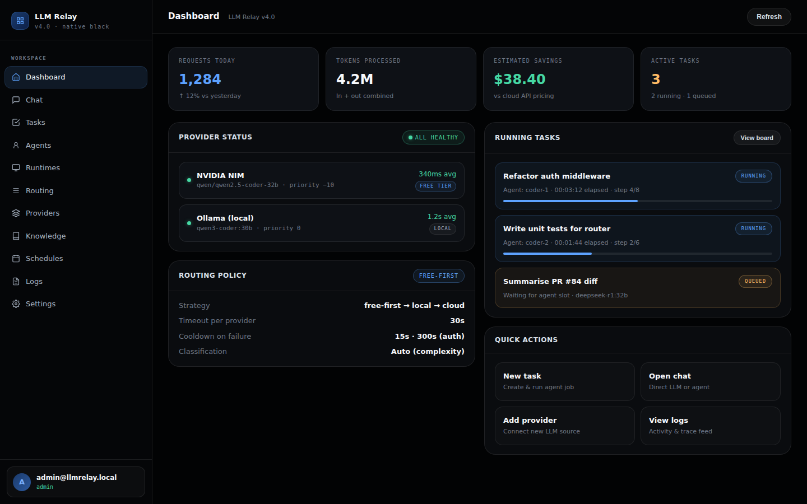
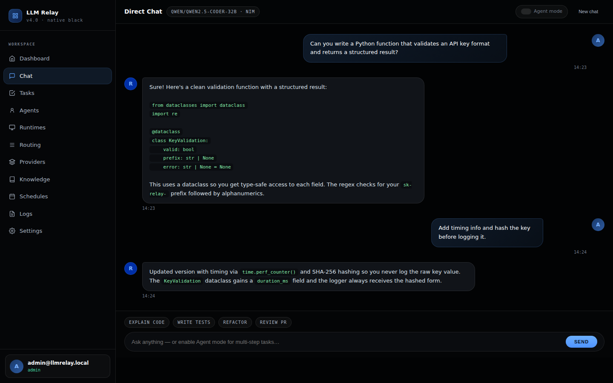
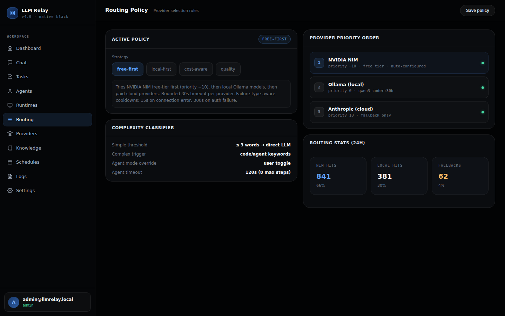
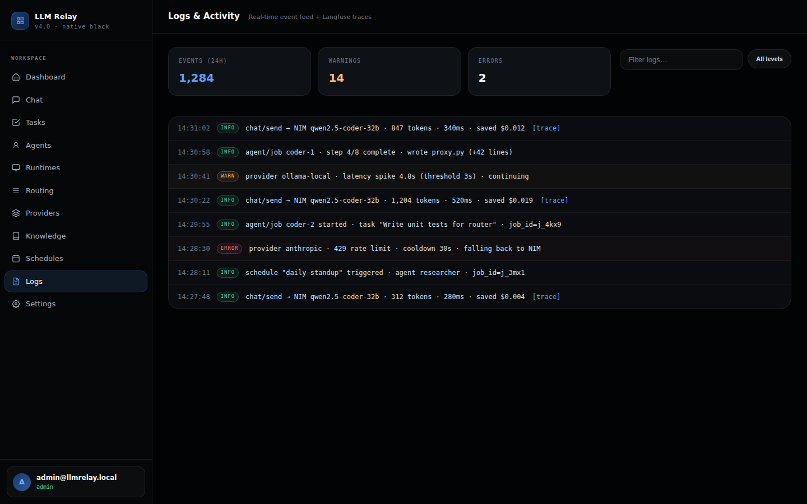
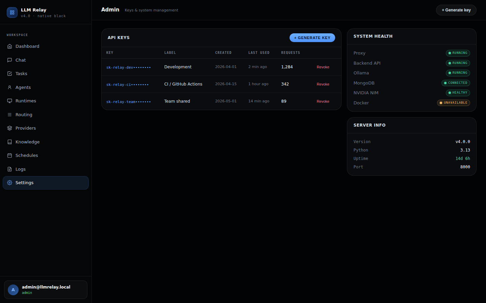
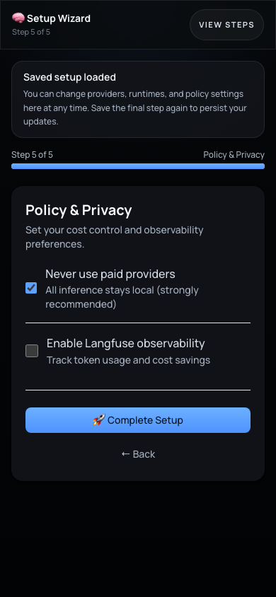

<div align="center">

# Agency Core

**Your first AI hire comes with an entire agency.**

Self-hosted · Privacy-first · One URL to start

[](https://github.com/strikersam/local-llm-server/releases/tag/v5.0.0)
[](https://github.com/strikersam/local-llm-server/actions/workflows/ci.yml)
[](https://github.com/strikersam/local-llm-server/actions/workflows/deploy-backend.yml)
[](https://www.python.org/)
[](LICENSE)

**[Live Demo](https://strikersam.github.io/local-llm-server/) · [API Docs](https://local-llm-server.onrender.com/docs) · [Changelog](docs/changelog.md)**

</div>

---

## The problem Agency Core solves

You're running a small or medium-sized company. You know AI could help — but the reality is messy:

- **Claude Code, Codex, and equivalent agentic platforms don't automatically do the work.** They need prompting, PR creation, test execution, CVE checks, and doc updates — and all of that requires skills setup and workflow creation that most teams never get right.
- **Your context isn't getting built.** Every prompt you send to Copilot or Claude is training data for someone else's model. The model gets smarter, but your agents don't learn your codebase, your preferences, or your business rules. Context built for your agents stays yours — it compounds over time and makes the next run faster and smarter than the last.
- **Monthly SaaS bills are stacking up.** Copilot + Notion AI + Jasper + SEO tool + monitoring tool = hundreds of dollars a month per person, and they don't talk to each other.
- **"AI agents" are mostly demos.** They hallucinate, they can't commit code, they don't remember yesterday, and they crash silently. Where AI agents genuinely help is running the full operations of a company — autonomously, end to end — in a managed platform that brings only the decisions that matter to you for approval.

Agency Core is the answer to all of this. It is a **self-hosted AI agency** — a platform that provisions a full fleet of specialist agents for your business from a single website URL, runs them 24x7 on hardware you control, and brings only the decisions that matter to you for approval.

---

## What you get

Paste one URL. Walk away. Come back to a working AI team.

```text
https://yourcompany.com
       ↓
  [Agency Core]
       ↓
  CEO agent + specialist fleet
  running 24x7 on your server
       ↓
  Bug fixes · PRs · blog posts · CVE scans · SEO · support replies
  — with your approval before anything ships
```

No config files. No integration wiring. No per-seat pricing. No data leaving your server.

---

## Who is this for?

### The 5-person SaaS startup that can't afford a full team yet

You ship fast but quality suffers. PRs pile up. Docs go stale. Dependencies rot. The security audit you've been meaning to run has been in the backlog for six months.

With Agency Core:
- A **Dev specialist** reviews every PR while you sleep and leaves inline comments
- A **Security specialist** runs a daily CVE scan and opens fix PRs automatically
- A **Docs specialist** keeps your README and API docs in sync with code changes — on every push
- A **Release manager** bumps the version, writes the changelog, tags, and opens the release PR — you just approve

**Result:** A team that works at night, never asks for a raise, and doesn't need you to explain the codebase.

---

### The e-commerce shop with a 10-person ops team

You're running Shopify or a custom store. Your team spends half their time on tasks a machine could do: updating product descriptions, checking for broken pages, triaging support tickets, monitoring SEO rankings.

With Agency Core:
- An **E-commerce specialist** monitors your storefront every 30 minutes for uptime issues, TLS expiry, and stack changes
- A **PIM specialist** keeps product descriptions, attributes, and taxonomy consistent
- A **Support specialist** triages incoming tickets, drafts responses, and flags edge cases for human review
- An **SEO specialist** watches ranking changes, identifies content gaps, and queues blog topics
- A **Content specialist** writes product copy and blog drafts from a brief you drop in plain English

**Result:** Your ops team focuses on decisions, not repetitive maintenance.

---

### The digital agency running 10 client accounts

You manage multiple companies' tech stacks. Right now that means 10 sets of credentials, 10 monitoring setups, 10 different runbooks.

With Agency Core:
- **Each client gets their own company profile** with its own agent fleet, knowledge graph, and schedules
- **Agents are isolated per tenant** — no cross-contamination of client data or context
- **One dashboard** to see the health of all clients, with per-client HITL approval flows
- **On-call handoff** is automatic — agents brief you when they find something, not at 3 AM when the site is down

**Result:** The same ops coverage you'd charge for a full-time hire, at marginal infrastructure cost.

---

### The professional services firm that runs on documents and tribal knowledge

Your company's knowledge lives in Slack threads, email chains, and the heads of people who might leave next month.

With Agency Core:
- The **Knowledge specialist** reads your code, docs, Slack exports, and past decisions and builds a living internal wiki — updated automatically when things change
- The **Research specialist** monitors industry trends, competitor moves, and technology updates and drops weekly digests
- The **Portfolio manager** tracks initiatives, surfaces blockers, and runs weekly stand-up summaries
- Every agent response comes with sources and reasoning — nothing is a black box

**Result:** Knowledge that doesn't walk out the door.

---

## How it works — the 5-minute version

1. **Paste your website URL.** `https://acme-store.com`
2. **Agency Core scans it.** Playwright + HTTP fingerprinting detects your tech stack, business systems, and integrations (Shopify, Stripe, Google Analytics, GitHub, Intercom, Salesforce, …).
3. **It asks you the right questions.** AI-generated onboarding questions based on what it found — not generic forms.
4. **Specialists are auto-provisioned.** A fleet of agents is assembled from 34 specialist families — exactly the ones your business needs, with the right runtimes and skills bound.
5. **Schedules activate.** Health scans, security audits, code quality checks, SEO monitoring, graph sync — all running on their own cadence without manual setup.
6. **You talk to the CEO in plain English.** "Fix the memory leak in issue #142." "Write the Q3 launch post." "Plan next sprint." The CEO decomposes the job, delegates to the right specialist, and returns a result with evidence — PR link, test output, diff, reasoning trace.
7. **You approve what matters.** Agents never merge code, deploy, or send external messages without your explicit sign-off. Low-risk tasks (formatting docs) can be auto-approved. High-stakes decisions (production deployments) always pause for you.



---

## The 24x7 agency — your agents never go idle

The defining feature of Agency Core is not what agents can do — it's that they keep doing it, automatically, even when you're not watching.

### What runs automatically after onboarding

| Schedule | Cadence | What it does |
|---|---|---|
| **Website health scan** | Every 30 min | Uptime, TLS expiry, stack drift detection |
| **Security audit** | Daily 9 AM | CVE scan, security headers, repo secret scan |
| **Stack change detection** | Daily 6 AM | New frameworks, dropped libraries, new integrations |
| **Code quality scan** | Daily 12 PM | Lint, duplication, complexity, stale dependencies |
| **Trend watch** | Every 6 hrs | Model releases, framework updates, competitor tech |
| **Company graph sync** | Every 30 min | Specialist health, runtime responsiveness, schedule status |
| **Doc-sync** | On every push | API docs, architecture records, and runbooks auto-updated |

### When something goes wrong, agents fix it — not you

```text
Health scan detects broken page at 3 AM
     ↓
Security or Dev specialist creates a fix task automatically
     ↓
Agent branches, writes fix, opens PR, watches CI
     ↓
CI green + low-risk → auto-approve gate passes, PR merges
CI green + needs human eyes → surfaces to your dashboard
     ↓
You see it in the morning: "PR merged, page restored at 3:12 AM"
```

### Nothing goes down quietly

| Failure scenario | Countermeasure |
|---|---|
| Agent crashes mid-task | Crash-recovery reconciler re-queues stranded tasks on restart |
| Runtime container stops | ⚡ Wake All Runtimes restarts every Docker container instantly |
| AI session rate-limited / exhausted | `ai_runner.py` watchdog detects the gap and resumes from last checkpoint |
| LLM provider goes down | Provider chain: Bedrock → NIM → DeepSeek → Anthropic → Ollama — automatic failover |
| Missed schedule | Scheduler reconciles on boot — nothing is silently skipped |
| Context lost between sessions | Company Graph + persistent chat history give full context on every wake |

---

## The full agent capability roster

### Engineering

| What you say | What the agent does |
|---|---|
| "Fix the bug in issue #142" | Reads issue, reproduces, writes fix, opens PR, watches CI, awaits your approval |
| "Audit our dependencies" | Scans for CVEs, generates an upgrade plan with test coverage, opens a safe PR |
| "Review this PR" | Multi-perspective analysis: security, correctness, performance, maintainability — inline comments |
| "Write tests for the auth module" | Generates unit + integration tests with realistic fixtures |
| "Do a release" | Bumps version, writes changelog, tags, runs CI, opens release PR |
| "Refactor the payment service" | Identifies coupling issues, proposes a plan, executes on approval |
| "Keep docs in sync" | After every push: updates API docs, architecture records, runbooks automatically |

### Content & knowledge

- Write product descriptions, landing pages, blog posts, and case studies from a brief
- Summarise and classify GitHub issues, Slack threads, and support tickets
- Maintain an internal wiki — agents update pages when code or decisions change
- Weekly trend digests: new model releases, framework updates, industry moves

### Operations & DevOps

- Monitor CI/CD pipelines; alert when something needs a human decision
- Schedule daily summaries, weekly audits, and on-call handoff briefs
- Route every LLM request to the optimal local model (code → Qwen3-Coder, reasoning → DeepSeek-R1)
- Real-time health diagnostics for all agents, runtimes, and providers

### Agile, portfolio & product

- **Agentic agile**: standups, retrospectives, sprint reviews, backlog grooming — coached cadence, automated artifacts
- **Portfolio management**: roadmapping, prioritisation, resource allocation, strategy tracking
- **Product**: turn a brief into user stories, acceptance criteria, and a prioritised backlog

### Business & domain specialists (auto-provisioned from the URL scan)

| Detected system | Specialist provisioned |
|---|---|
| Storefront / commerce stack | **E-commerce** · **Merchandising** · **OMS** |
| Product catalog / PIM | **PIM** (product data, attributes, taxonomy) |
| Media / asset platform | **DAM** (ingestion, metadata, delivery) |
| CRM / support desk | **CRM operations** · **Support** (triage, KB, SLA) |
| Analytics / search / SEO | **Analytics** · **SEO** · **Content strategist** |
| Marketing automation | **Marketing** (campaigns, attribution, A/B) |
| Research / market data | **Trading & market research** · **Research** |
| Cloud / infra / CI | **Platform operations** · **DevOps** · **Security** · **CI/fix** |

> **34 specialist families total** — engineering + business + domain. Each family has typed I/O contracts, an optimal runtime, and bound Skills.

---

## The skill library — superpowers agents can call

Every specialist can call typed, versioned Skills on demand:

| Skill | What it does |
|---|---|
| **ECC** | Orchestrate other AI harnesses: Claude Code, Cursor, Codex, OpenCode, Aider |
| **Graphify** | Query your entire codebase as a knowledge graph — 70x fewer tokens than reading files |
| **Council Review** | Multi-perspective diff review: security / correctness / performance / maintainability — structured APPROVE / REJECT verdict |
| **Obsidian Knowledge Graph** | BFS traversal, connected components, tag search over your internal wiki |
| **Dependency Audit** | CVE scan + safe upgrade PR generation |
| **Agentic Agile** | Sprint ceremonies, retros, standups as a coached cadence |
| **Financial Analyst** | Burn rate, runway, gross margin, ROI-based budget reallocation |
| **Release Readiness** | Gate check before any version tag |
| **Docs Sync** | Keep API docs and architecture records in sync after code changes |

The **Skill Registry** discovers new skills automatically from GitHub repositories — flat or nested layouts — with ETag caching and rate-limit-aware fetching. No restart required.

---

## HITL approval gates — you stay in control

Agency Core never merges code, deploys, or sends external messages without your explicit sign-off.

1. **Agent reaches a decision gate** → pauses, surfaces exactly what will happen (the diff, the deploy command, the email body)
2. **You choose**: Approve · Deny · Redirect (send back with comments)
3. **Gate policy is configurable per task type**: auto-approve reformatting, require sign-off on production deployments

This means you get the leverage of a 24x7 team without the risk of autonomous agents acting beyond their mandate.

---

## Quick Notes — capture ideas from your phone

Drop a task from anywhere — no laptop needed.

1. Use an iOS Shortcut or share sheet to POST a URL + instruction
2. Agency Core's **Quick Note processor** enqueues it with capped-backoff retry
3. The CEO routes it to the right specialist as a normal task
4. You see it on the Task Board when you open your laptop

---

## Issue → Context → Draft PR automation

Every GitHub issue is automatically turned into an actionable, codebase-aware
implementation plan — no manual triage required.

```text
issue opened (or `quick-note` label added)
        ↓
  [issue-context-generator workflow]
        ↓
  fetch linked URL (multi-strategy)  ──►  NVIDIA NIM (free models)
        ↓                                 fallback: Claude Opus
  generate: implementation prompt + prioritised TODO list
            + relevant files + risk flags, grounded in CLAUDE.md
            and the graphify codebase graph
        ↓
  commit docs/context/issue-N.md  ──►  open DRAFT PR  ──►  close issue
```

**Why draft PRs?** Draft status suppresses CodeRabbit / Copilot auto-reviews,
so the plan lands cleanly without burning review cycles. When you (or the
*Process Quick Note* workflow) implement against the plan, mark the PR ready
for review.

### The workflows

| Workflow | Trigger | What it does |
|----------|---------|--------------|
| **`issue-context-generator.yml`** | Any issue `opened`, or `quick-note` label added | Fetches the linked URL, generates a grounded prompt + TODO plan, commits `docs/context/issue-N.md`, opens a **draft PR**, closes the issue. |
| **`bulk-issue-context.yml`** | Manual (`workflow_dispatch`) | Backfills **all** open issues in one run. Supports `dry_run`, label exclusions, explicit `issue_numbers` targeting, and `regenerate` mode (updates an existing draft PR in place — preserves the PR number). |
| **`process-quick-note.yml`** | Schedule / manual | Picks up a context branch and implements the plan — runs the agentic loop, tests, applies review feedback, and opens its PR as a **draft**. Reuses an existing `claude/context-issue-N` branch so implementation commits land on the pre-built draft PR. |

### Free-first model routing

Context generation runs on **free NVIDIA NIM models** by preference —
`qwen/qwen3-coder-480b-a35b-instruct` → `nvidia/llama-3.3-nemotron-super-49b-v1`
→ `meta/llama-3.3-70b-instruct` → `qwen/qwen2.5-coder-32b-instruct`, with
Claude Opus as a final fallback only if every NVIDIA model is unavailable.

### Backfilling existing issues

```bash
# Dry run — list what would be processed, change nothing
gh workflow run bulk-issue-context.yml -f dry_run=true

# Process all open issues (skips exhausted / agency-escalation by default)
gh workflow run bulk-issue-context.yml

# Target specific issues; regenerate updates existing draft PRs in place
gh workflow run bulk-issue-context.yml \
  -f issue_numbers="416,398,364" -f regenerate=true
```

> **Note:** the `issues`-event auto-trigger only fires once these workflows are
> on the **default branch (master)** — GitHub runs event-triggered workflows
> from master only. Before merge, use `workflow_dispatch` (the `bulk-issue-context`
> commands above) to process issues from any branch.

---

## Privacy, security, and cost

### Your data never leaves your server

Agency Core runs entirely on hardware you control. There is no cloud relay, no usage telemetry, no shared inference endpoint. Your code, your prompts, your company graph — all local.

### What it costs to run

| What you'd pay elsewhere | Agency Core equivalent | Monthly cost |
|---|---|---|
| GitHub Copilot (5 seats) | Dev specialist on Qwen3-Coder | $0 (local GPU) or ~$5 (NIM) |
| Notion AI | Knowledge specialist | $0 |
| Jasper / Copy.ai | Content specialist | $0 |
| Snyk / Dependabot Pro | Security specialist | $0 |
| A part-time DevOps engineer | Platform ops + CI/fix specialists | $0 |
| **Total comparison** | **Agency Core on a $10 VPS** | **~$10/month** |

> Marginal inference cost is electricity. Scale a 50-person team for the same server bill.

### Security posture

- **No secrets in source** — all config via environment variables; nothing hardcoded
- **RBAC**: three roles — `user`, `power_user`, `admin`
- **JWT Bearer auth** on every API endpoint; configurable expiry
- **Ed25519 instance activation** — tamper-evident licensing
- **Audit log** for all admin actions
- **Bandit SAST + CodeQL + secret scanning** on every push
- **Dependency CVE audit** on every PR
- **Per-task git worktree isolation** — concurrent agents can't clobber each other

---

## The V5 Control Plane — every screen

| Screen | What it does |
|---|---|
| **Dashboard** | Live health of all agents, recent activity, system metrics |
| **Chat** | Conversational interface to the CEO agent; full persistent history |
| **Task Board** | Kanban: queued → planning → executing → review → awaiting approval → done |
| **Agents** | All specialists: capabilities, current load, runtime, model, task stats |
| **Providers** | Connected LLM providers (Ollama, Bedrock, Nvidia NIM) with health + cost |
| **Runtimes** | Execution substrates: internal loop, Docker agents, external harnesses |
| **Knowledge** | Internal wiki — maintained by agents from code, docs, and decisions |
| **Schedules** | Recurring agent tasks; pause, resume, trigger, view run history |
| **Skills** | The skill library — what each specialist can call and when |
| **Intelligence** | Routing policy editor — model, cost tier, and task-type rules |
| **Logs** | Every LLM call: tokens, latency, provider, cost, decision context |
| **Company** | Organisation profile, tech stack, knowledge graph seed |
| **Admin** | Users, roles, instance activation, audit log, onboarding controls |
| **Doctor** | Live self-diagnostics — one-click Fix buttons per failing check |

---

## Screens

<!-- README_UI_GALLERY:START -->
### 🛰 Control Plane

The command center: live agent health, recent activity, and system metrics at a glance.

<p align="center"></p>

### 🛬 Login

People can sign in through a simple starting page instead of touching raw config files.

<p align="center"></p>

### 🧙 Setup Wizard

The wizard helps you choose providers, models, runtimes, a default agent, and a cost policy.

<p align="center"></p>

### 💬 Chat

This is where you talk to the CEO agent directly.

<p align="center"></p>

### 🗂 Task Board

This makes AI work visible. You can see what is waiting, running, blocked, in review, or done.

<p align="center"></p>

### 🤖 Agent Roster

Your cast of AI specialists. Each agent has its own model, runtime, specialty, and rules.

<p align="center"></p>

### ⚙️ Runtimes

The engines behind the scenes that actually run your AI work.

<p align="center"></p>

### 🛣 Routing Policy

Control how smart, cheap, fast, or private the system is when picking a model.

<p align="center"></p>

### 🔌 Providers and Models

Connect local and cloud AI sources and choose which models are available.

<p align="center">
  
  &nbsp;
  
</p>

### 📚 Knowledge

Your team's memory: wiki pages, source material, and reusable context.

<p align="center"></p>

### 🔭 Logs and activity

Every LLM call: token count, latency, cost, and decision context.

<p align="center"></p>

### 🗓 Schedules

Make AI jobs run later or recur automatically.

<p align="center"></p>

### 🧭 Settings and guardrails

Central settings: defaults, policies, and integrations in one place.

<p align="center"></p>

### 🛡 Admin portal

Manage access, instance activation, and system behavior.

<p align="center"></p>

### 📱 Mobile

The dashboard is responsive — sign in, run the setup wizard, and monitor agents from a phone.

<p align="center">
  
  &nbsp;
  
</p>
<!-- README_UI_GALLERY:END -->

---

## Architecture

```
┌──────────────────────────────────────────────────────────────────────┐
│  React V5 SPA (GitHub Pages)        Remote Admin (Vercel)            │
└──────────────────────┬───────────────────────────────────────────────┘
                       │ HTTPS / JWT Bearer
┌──────────────────────▼───────────────────────────────────────────────┐
│  FastAPI Backend  (Render / Docker / uvicorn)                         │
│  ├─ /v1/chat/completions    OpenAI-compatible proxy (Cursor, Aider)  │
│  ├─ /api/chat/send          CEO agent conversational API             │
│  ├─ /api/tasks/*            Task CRUD + async dispatcher             │
│  ├─ /api/agent/*            Agent job management + HITL gates        │
│  ├─ /api/quick-notes        Quick Note queue (iPhone Shortcuts)      │
│  ├─ /api/doctor             Live self-diagnostics                    │
│  ├─ /api/ping               Liveness probe                           │
│  ├─ /api/activation/*       Instance licensing + user management     │
│  └─ /mcp-internal           MCP server for agent tool calls          │
├──────────────────────────────────────────────────────────────────────┤
│  ModelRouter — task classification → optimal model selection          │
│  ├─ Code tasks    → Qwen3-Coder / DeepSeek-Coder                    │
│  ├─ Reasoning     → DeepSeek-R1                                      │
│  └─ Fast / chat   → smallest capable model                           │
├──────────────────────────────────────────────────────────────────────┤
│  AgentRunner — plan → execute → verify → judge → summarise           │
│  ├─ CEO agent (orchestrator + domain classifier)                     │
│  ├─ 34 specialist families (engineering + business + domain)         │
│  └─ Workflow engine (persisted state machine, HITL gates)            │
├──────────────────────────────────────────────────────────────────────┤
│  Task Dispatcher — async poll loop + crash-recovery reconciler        │
│  ├─ Per-task git worktree isolation                                  │
│  └─ External runtimes: Docker · OpenCode · Aider · Goose · Hermes   │
├──────────────────────────────────────────────────────────────────────┤
│  Skill Registry — flat + subdir GitHub layouts, ETag caching          │
│  ├─ Semaphore rate-limiting (≤ 60 req/h unauthenticated)            │
│  └─ Dynamic tech-relevance extraction for context-aware binding      │
├──────────────────────────────────────────────────────────────────────┤
│  Storage (swappable without restart)                                  │
│  ├─ MongoDB (default) — Motor async driver                           │
│  └─ SQLite  (STORAGE_BACKEND=sqlite) — zero external deps            │
│  Observability — Langfuse traces + local TCO cost model              │
└──────────────────────────────────────────────────────────────────────┘
```

---

## Setup

### What you need

- **Python 3.13+**
- **An LLM** — [Ollama](https://ollama.com/) with one local model, **or** a free [Nvidia NIM](https://build.nvidia.com/) API key (no GPU required)
- **Node 20+** — for the web UI
- **MongoDB** — or set `STORAGE_BACKEND=sqlite` to skip it entirely

No Kubernetes. No cloud account. A Raspberry Pi 5 can run the core services.

### 1. Clone and install

```bash
git clone https://github.com/strikersam/local-llm-server.git
cd local-llm-server
python -m venv .venv && source .venv/bin/activate
pip install -r backend/requirements.txt
```

### 2. Configure

```bash
cp .env.example .env
```

Minimum viable `.env` for local development (no MongoDB, no GPU):

```bash
STORAGE_BACKEND=sqlite         # zero-dependency storage
ADMIN_EMAIL=you@example.com
ADMIN_PASSWORD=changeme
SECRET_KEY=$(openssl rand -hex 32)
NVIDIA_API_KEY=nvapi-...       # free at build.nvidia.com — no GPU needed
```

Full list of variables: [`docs/configuration.md`](docs/configuration.md)

### 3. Start the backend

```bash
uvicorn backend.server:app --host 0.0.0.0 --port 8001
```

Verify: `curl http://localhost:8001/api/ping` → `{"status":"ok","pong":true}`

### 4. Start the frontend (development)

```bash
cd frontend && npm install
REACT_APP_BACKEND_URL=http://localhost:8001 npm start
```

Visit [http://localhost:3000](http://localhost:3000) — the Setup Wizard appears on first boot.

### 5. Onboard your first company

```bash
# From the UI: Companies → Paste URL → Onboard
# Or via API:
curl -X POST http://localhost:8001/api/company/{id}/onboarding/start \
  -H "Authorization: Bearer <your-token>" \
  -H "Content-Type: application/json" \
  -d '{"website_urls": ["https://yourcompany.com"]}'
```

### 6. Connect your AI coding tools (optional)

```jsonc
// Cursor — settings.json
{
  "cursor.ai.openaiBaseUrl": "http://localhost:8000",
  "cursor.ai.openaiApiKey": "your-api-key-here"
}
```

See [`client-configs/`](client-configs/) for Aider, Continue, Zed, VSCode, and Claude Code.

---

## Cloud deployment (Render + GitHub Pages)

Push to `master` — CI does the rest:

1. Python 3.13 tests · frontend build · lint · SAST · secret scan · CVE audit
2. Docker build → Render deploy hook → health check
3. React build → GitHub Pages

```text
Required secrets:
  RENDER_DEPLOY_HOOK_URL   → Render → service → Settings → Deploy Hook
  RENDER_BACKEND_URL       → your Render service URL
```

Live demo:
- **Frontend**: `https://strikersam.github.io/local-llm-server/`
- **API**: `https://local-llm-server.onrender.com/docs`

> Render free tier sleeps after 15 min of inactivity (~30 s cold start). Upgrade to Starter ($7/mo) for always-on in production.

---

## Configuration reference

| Variable | Default | Description |
|---|---|---|
| `SECRET_KEY` | *(required)* | JWT signing key — `openssl rand -hex 32` |
| `STORAGE_BACKEND` | `mongo` | `sqlite` for zero-dependency storage |
| `MONGO_URL` | `mongodb://localhost:27017` | MongoDB connection string |
| `OLLAMA_BASE_URL` | `http://localhost:11434` | Local Ollama server |
| `LLM_PROVIDER` | `ollama` | `ollama` · `nvidia-nim` · `deepseek` · `bedrock` · `anthropic` |
| `NVIDIA_API_KEY` | *(optional)* | Free-tier cloud inference — no GPU required |
| `AWS_ACCESS_KEY_ID` + `AWS_SECRET_ACCESS_KEY` | *(optional)* | AWS Bedrock |
| `ANTHROPIC_API_KEY` | *(optional)* | Direct Anthropic API |
| `DEEPSEEK_API_KEY` | *(optional)* | DeepSeek cloud API |
| `GITHUB_TOKEN` | *(optional)* | Required for agents that open PRs or read issues |
| `LANGFUSE_HOST` + keys | *(optional)* | Observability traces |
| `TELEGRAM_BOT_TOKEN` | *(optional)* | Remote control via Telegram |
| `ADMIN_EMAIL` + `ADMIN_PASSWORD` | *(optional)* | First admin — created on first boot |
| `RUNTIME_DOCKER_ENABLED` | `false` | Enable Docker agent runtime |

### Provider priority chain

```
AWS Bedrock (15) → Nvidia NIM (10) → DeepSeek (8) → Anthropic (7) → HuggingFace (5) → Ollama (3)
```

Only providers with keys configured are tried. Set just the keys you have.

---

## Agent runtimes

| Specialist family | Runtime | Type |
|---|---|---|
| `frontend` · `ux` · `design` · `docs` · `operations` | **Goose** | 🐳 Docker |
| `backend` · `mobile` · `ecommerce` · `qa` | **OpenCode** | 🐳 Docker |
| `security` · `engineering` · `architecture` · `ml` | **Claude Code** | 💻 CLI |
| `devops` · `cloud` · `infra` | **Aider** | 🐳 Docker |
| `analytics` · `data` | **Hermes** | 🐳 Docker |
| Long-running workflows | **Task Harness** | 🐳 Docker |
| `agile` · `portfolio` | **Internal Agent** | 🏠 Built-in |

⚡ **Wake All Runtimes** on the Runtimes page starts every container for a company's specialists in one click.

---

## Development

```bash
pytest -x             # fast-fail
pytest -v             # verbose

git config core.hooksPath .claude/hooks   # activate changelog enforcement

python generate_api_key.py                # generate a new API key

python scripts/ai_runner.py start         # start an AI coding session
python scripts/ai_runner.py status        # show current session state
python scripts/ai_runner.py resume        # resume from last checkpoint
python scripts/ai_runner.py logs          # tail session logs
```

See [`CLAUDE.md`](CLAUDE.md) for the contributor guide, skill map, risky-module policy, and AI agent working rules.

---

## Roadmap

| Phase | Status | What shipped |
|---|---|---|
| 1 — Typed agent contract | ✅ Done | `AgentJobRequest` / `AgentJobResult` Pydantic contract, E2E tests |
| 2 — ModelRouter wiring | ✅ Done | Single router for all request types; classification → model hint |
| 3 — SQLite + one backend | ✅ Done | Swappable storage adapter, zero-dep option |
| 4 — Runtime resilience | ✅ Done | Crash-recovery reconciler, worktree isolation, opt-in external runtimes |
| 5 — Doctor & dashboard resilience | ✅ Done | Live self-diagnostics, `useSafeData` hook, per-check Fix buttons |
| 6 — Workflow engine | ✅ Done | Persisted state machine, CEO agency, branch/PR safety, HITL gates |
| 7 — Onboarding engine | ✅ Done | URL → stack inference → system detection → specialist provisioning → 24x7 agency |
| 8 — Multi-tenant isolation | ✅ Done | Per-user scoping across all resources; IDOR-safe cross-tenant access |
| 9 — AI onboarding + Quick Notes | ✅ Done | AI-tailored onboarding questions; Quick Note processor; skill registry ETag + rate limiting |

---

## License

MIT — see [LICENSE](LICENSE)

---

<div align="center">

**Agency Core** — the AI team that works while you sleep, on a server you own.

<sub>Built for engineers and operators who want the leverage of frontier AI without the cloud bill, the privacy compromise, or the headcount.</sub>

</div>
