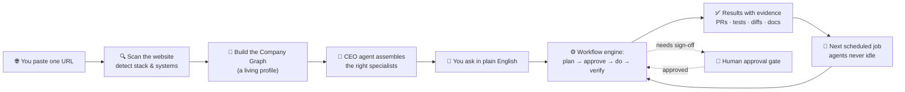

<div align="center">

# Agency Core

### The autonomous AI platform for engineering teams — self-hosted, privacy-first, runs anywhere.

[](https://github.com/strikersam/local-llm-server/releases/tag/v5.0.0)
[](https://github.com/strikersam/local-llm-server/actions/workflows/ci.yml)
[](https://github.com/strikersam/local-llm-server/actions/workflows/deploy-backend.yml)
[](https://www.python.org/)
[](LICENSE)

**[Live Demo](https://strikersam.github.io/local-llm-server/) · [API Docs](https://local-llm-server.onrender.com/docs) · [Changelog](docs/changelog.md)**

</div>

---

## What is Agency Core?

**Agency Core is an autonomous AI agency.** You onboard a company with **a single URL** — that's the whole setup. From that URL, Agency Core scans the website, infers the tech stack and business systems, builds a persistent **Company Graph**, and **auto-provisions a fleet of specialist agents** led by a **CEO orchestrator**.

From that moment the agency runs the company's knowledge-work itself: it delegates the **entire consulting engagement — agile delivery, portfolio management, software development, design, SEO/content, e-commerce operations, support, bug fixes, and more — to agents**, and only comes back to you for approvals.

You don't wire up integrations or write config. You paste a URL; the agency figures out what the company is, what specialists it needs, which skills to bind, and what recurring work to run — then does it, with evidence (PR links, test output, diffs, reasoning traces) for every action.

It is **self-hosted and privacy-first**: everything runs on a server you control — your laptop, a $10 VPS, or a GPU box — and your data never leaves your perimeter. Under the hood it is also a **drop-in OpenAI-compatible proxy** for Ollama, so Cursor, Continue, Aider, and Claude Code can point at `http://localhost:8000` and use your local models through one authenticated endpoint.

> **One URL in → a working AI agency out.** Onboard `https://yourcompany.com` and the CEO + specialists start running agile boards, managing the portfolio, shipping code, reviewing PRs, writing docs and content, monitoring operations — and never go idle.

---

## In plain English

Think of Agency Core as **hiring a whole agency that happens to be AI** — and onboarding them takes one step.

1. **You give it your website address.** (e.g. `https://acme-shop.com`)
2. **It studies the business.** It reads the site, works out what the company does and what tools it uses (online store, support desk, analytics, code, …), and writes that down as a living profile.
3. **It hires the right team.** A "CEO" agent assembles specialists for exactly what your business needs — developers, designers, an agile coach, a portfolio manager, SEO/content, e-commerce ops, support, and so on.
4. **It gets to work — and stays at work.** You chat in plain English ("fix this bug", "plan next sprint", "write the launch blog post"). The CEO splits the job up, hands pieces to the right specialists, and they do the work — then show you the results with proof (links, tests, diffs). Schedules keep agents running 24x7; a crash-recovery watchdog brings anything back that falls over.
5. **You stay in control.** Anything important pauses for your **yes/no approval** before it happens. Nothing is sent to the cloud — it all runs on your own machine.



---

## Why self-hosted autonomous agents?

| The problem | What Agency Core does instead |
|---|---|
| Frontier AI tools upload your code to third-party servers | Everything runs on hardware you control; data never leaves your perimeter |
| ChatGPT / Copilot give one-shot answers, not persistent work | Agents plan, execute, verify, and loop back only when a human decision is needed |
| Managing multiple AI tools means multiple accounts, keys, and bills | One platform, one API key, one dashboard — unlimited local inference |
| AI "agents" are demo toys that can't commit code or open PRs | Full git integration: branch → commit → PR → CI watch → HITL approval gate → merge |
| No visibility into what the AI did or why | Langfuse observability: every LLM call, token count, latency, cost, and decision trace |
| Cloud AI pricing scales with usage — costs explode at team scale | Marginal inference cost is electricity; scale a 50-person team for the same server bill |
| Agents go idle and lose context between sessions | Crash-recovery reconciler + AI runner watchdog keep every agent alive and resumable |

---

## Features

### The full agent capability roster

Once onboarded, Agency Core runs a fleet of specialists coordinated by a CEO agent. You describe what you want in plain English; the CEO decomposes it into a structured plan, assigns subtasks to the right specialist, and returns results with evidence.

#### Engineering agents

- **Bug fixing**: analyse a bug report, write a fix, open a PR, watch CI, wait for your approval before merging
- **Dependency audit**: scan for CVEs, create a safe upgrade PR with passing tests
- **Code review**: check any PR for security holes, N+1 queries, missing error handling, and injection risks
- **Test generation**: write unit and integration tests for new or existing code
- **Refactoring**: identify tech debt hotspots, propose a refactor plan, execute on approval
- **Release management**: bump version, draft changelog, tag, verify CI, open the release PR
- **Documentation**: keep API docs, architecture records, and runbooks in sync with code changes

#### Content & knowledge agents

- Write product descriptions, blog posts, or wiki articles from a brief
- Keep your internal knowledge base accurate — agents update docs when code changes
- Summarise and classify incoming GitHub issues, Slack threads, and support tickets
- Schedule weekly trend digests and release notes automatically

#### Operations agents

- Monitor CI/CD pipelines and alert you when something needs a human decision
- Manage recurring schedules: daily summaries, weekly audits, on-call handoffs
- Classify every request to the optimal local model (code → Qwen3-Coder, reasoning → DeepSeek-R1)
- Provide real-time health diagnostics for all running agents, runtimes, and providers

#### Agile, portfolio & design agents

- **Agentic agile**: run sprints, standups, retros, and backlog grooming as a coached cadence
- **Agentic portfolio management**: roadmapping, prioritisation, resource allocation, and strategy across initiatives
- **Design & UX**: UI/UX proposals, prototyping notes, design-system consistency reviews
- **Product**: turn briefs into requirements, user stories, and prioritised roadmaps

#### Business & domain agents (auto-provisioned from the scan)

Based on what the URL scan detects, Agency Core spins up the right **domain specialists** — not just generic engineers:

| Detected system | Specialist provisioned |
|---|---|
| Storefront / commerce stack | **E-commerce**, **Merchandising**, **OMS** (order management) |
| Product catalog / PIM | **PIM** specialist (product data, attributes, taxonomy) |
| Asset / media platform (DAM) | **DAM** specialist (ingestion, metadata, delivery) |
| CRM / support desk | **CRM operations**, **Support** (triage, KB, SLA) |
| Analytics / search / SEO | **Analytics**, **SEO**, **Content strategist** |
| Marketing automation | **Marketing** (campaigns, attribution, A/B) |
| Markets / research needs | **Trading & market research**, **Research** |
| Cloud / infra / CI | **Platform operations**, **DevOps**, **Security**, **CI/fix** |

> The full roster is **34 specialist families** (engineering + business + domain). Each specialist has typed inputs/outputs, routing rules, an optimal runtime, and **bound Skills** it can call.

### Skills the agents can use

Specialists and workflows bind to a **typed Skill Library**, including:

- **ECC** — cross-harness agent orchestration (Claude Code, Cursor, Codex, OpenCode, …)
- **Obsidian Knowledge Graph** — typed knowledge graph (BFS, connected components, tag search)
- **Graphify** — token-efficient codebase querying over the knowledge graph
- **Council Review** — multi-perspective (security / correctness / performance / maintainability) review of a diff with a structured verdict
- plus agile, financial-analyst, dependency-audit, docs-sync, release-readiness, and more

The skill registry supports both flat and nested GitHub directory layouts, ETag caching, and semaphore-controlled rate limiting. New skills are discovered automatically via the registry API without restarting the server.

### AI-powered onboarding

The onboarding engine generates **AI-tailored questions** based on the detected domain and tech stack — not generic forms. Answer them once and the agency creates scoped remediation tasks, provisions the right specialists, and configures 24x7 schedules immediately.

```bash
# Generate context-aware onboarding questions for a company
POST /api/companies/{id}/onboarding/questions

# Submit answers → remediations + specialist provisioning happen automatically
POST /api/companies/{id}/onboarding/answers
```

### Quick Notes (iPhone → agent tasks)

Capture a thought from your phone and it becomes an agent task automatically. The **Quick Note processor** accepts URL-based payloads (Shortcuts app, share sheet), enqueues them with capped-backoff retry, and routes them to the right specialist — no laptop needed.

```bash
# iOS Shortcut / share sheet → this endpoint → agent task
POST /api/quick-notes
```

---

## 24x7 autonomous operations — agents never go idle

This is the core promise: **after onboarding, your agents own the work**. The platform is built so specialists stay alive, resume after crashes, and run on schedule without human babysitting.

### What activates automatically at onboarding

| Schedule | Cadence | What it does |
|----------|---------|--------------|
| Website health scan | Every 30 min | Check all company sites for uptime, TLS expiry, and stack changes |
| Security audit | Daily 9 AM | CVE scan, security headers, repo secret scanning |
| Stack change detection | Daily 6 AM | Re-scan for new frameworks, removed libraries, new integrations |
| Code quality scan | Daily 12 PM | Lint compliance, duplication, complexity, dependency freshness |
| Trend watch | Every 6 hrs | New model releases, framework updates, competitor tech changes |
| Company graph sync | Every 30 min | Verify all specialists healthy, runtimes responsive, schedules executing |
| Doc-sync | On every push | Keep API docs, architecture records, and runbooks in sync with code |

### How agents stay alive 24x7

**No agent ever dies quietly.** Every mechanism that could leave an agent idle or stranded has a countermeasure:

| Failure scenario | Countermeasure |
|---|---|
| Agent crashes mid-task | Crash-recovery reconciler re-queues stranded `IN_PROGRESS` tasks on restart |
| Runtime container stops | ⚡ **Wake All Runtimes** button (or `POST /runtimes/wake-company-runtimes`) restarts every Docker container instantly |
| AI coding session exhausted / rate-limited | `python scripts/ai_runner.py resume` — AI runner watchdog detects the gap and resumes from the last checkpoint |
| Schedule misfires | Scheduler reconciles missed runs on boot; nothing is silently skipped |
| Context lost between sessions | Company Graph + per-session chat history give every agent full context on every wake |
| LLM provider goes down | Provider priority chain (Bedrock → NIM → DeepSeek → Anthropic → Ollama) — automatic failover, no human intervention |

### Company maintenance loop

Once activated, the agency runs a continuous maintenance loop without you:

```
┌─────────────────────────────────────────────────────────────┐
│  Every 30 min: Health scan → issues found?                  │
│    ├─ No  → log green, schedule next run                    │
│    └─ Yes → Security/Dev specialist creates fix task        │
│              ↓                                              │
│  Dev specialist: analyse → branch → fix → PR → CI          │
│    ├─ CI green + low-risk → auto-approve gate passes        │
│    └─ CI green + needs review → surfaces to you for sign-off│
│              ↓                                              │
│  Merge → Doc-sync updates runbooks → Graph sync verifies   │
│              ↓                                              │
│  Next scheduled run picks up, loop continues               │
└─────────────────────────────────────────────────────────────┘
```

Support tickets, bug reports, and GitHub issues follow the same loop — the Support specialist triages, Dev fixes, you approve merges.

### HITL approval gates

Agency Core never merges code, deploys, or sends external messages without your sign-off:

1. Agent reaches a gate → pauses and surfaces the decision in your dashboard
2. Shows exactly what will happen — the diff, the deploy command, the message body
3. Waits for your **Approve**, **Deny**, or **Redirect** (send back with comments)

Gates are configurable per task type: auto-approve low-risk operations (reformatting docs), require explicit sign-off on anything touching production.

---

## Using your autonomous agency

### Getting started — first boot

Deploy Agency Core (Docker, Render, or `uvicorn` locally). On first boot:

1. **Setup Wizard** walks you through five steps: connect Ollama, generate API key, create admin, pull a model, run health check
2. **Doctor screen** confirms every dependency is reachable — git, GitHub token, repo access, Langfuse, runtimes. Each failing check has a **Fix** button that resolves it in one click
3. **No local GPU?** Set `LLM_PROVIDER=nvidia-nim` and `NVIDIA_API_KEY=<your-key>` to use Nvidia's free-tier hosted models
4. **Website scanning?** Install Playwright to detect JS-rendered technologies:
   ```bash
   pip install playwright && playwright install --with-deps chromium
   ```

### The automatic flow — one URL, fully managed

```bash
# One API call starts the whole agency:
curl -X POST http://localhost:8001/api/company/{id}/onboarding/start \
  -H "Content-Type: application/json" \
  -d '{"website_urls": ["https://yourcompany.com"]}'
```

| Step | What runs | Output |
|------|-----------|--------|
| **Scan website** | `services/scanner.py` — Playwright + curl_cffi | Detected stack: React, Next.js, Shopify, Stripe, Google Analytics |
| **AI onboarding questions** | `services/onboarding.py` | Context-aware questions generated from detected domain + stack |
| **Detect systems** | `services/onboarding.py` step 4 | System types: `frontend`, `backend`, `ecommerce`, `analytics`, `payment_gateway` |
| **Provision specialists** | `services/specialist.py` + runtime auto-assignment | 5 specialists: Frontend (Goose), Backend (OpenCode), Security (Claude Code), Analytics (Hermes), Operations (Goose) |
| **Create workflows** | `services/onboarding.py` step 6 | Development + QA workflows with specialist assignments |
| **Activate 24x7 agency** | `services/company_agency.py` | 6 always-on schedules: health scan, security audit, stack monitor, code quality, trend watch, graph sync |

### Talking to your agency

Once agents are running, talk to the CEO in plain English. Because the Company Graph knows your stack, answers are context-aware:

> "There's a memory leak in the session manager reported in issue #142. Find the root cause, write a fix, and open a PR for my review."

The CEO agent reads the issue, produces a structured plan, delegates to the Dev specialist, and returns a PR link with test results. Every conversation is persisted — pick up where you left off.

### Interacting with your running agency

| Interface | What it does |
|-----------|-------------|
| **Chat** | Talk to the CEO agent in plain English — it decomposes tasks, delegates to specialists, and returns results with PR links and test output |
| **Task Board** | Kanban view of all agent jobs: queued → planning → executing → verifying → awaiting approval → done |
| **Quick Notes** | Fire tasks from your iPhone via Shortcuts or share sheet — URL-initiated, retried automatically |
| **Schedules** | Pause, resume, or delete any 24x7 schedule; trigger immediate runs |
| **Runtimes** | Start/stop individual runtimes, or ⚡ Wake All Runtimes for a company |
| **Admin** | Manage users, assign roles, toggle onboarding per user, view audit logs |

---

## The V5 Control Plane — every screen

| Screen | What it does |
|--------|-------------|
| **Dashboard** | Live health of all agents, recent activity, and system metrics at a glance |
| **Chat** | Conversational interface to the CEO agent; full persistent history per session |
| **Task Board** | Kanban view of all agent jobs: queued → planning → executing → review → done |
| **Agents** | All registered specialists with capabilities, current workload, runtime, and model — aggregate task stats per agent |
| **Providers** | Connected LLM providers (Ollama, AWS Bedrock, Nvidia NIM) with health and cost data |
| **Runtimes** | Execution substrates — internal loop, Docker agent, external harnesses (OpenCode, Aider, Goose) |
| **Knowledge** | Internal wiki maintained by agents from your code, docs, and past decisions |
| **Schedules** | Recurring agent tasks with cron-style timing and run history |
| **Skills** | The agent skill library — what each specialist knows how to do and when it activates |
| **Intelligence** | Routing policy editor — control which model handles which task type and at what cost tier |
| **Logs** | Full trace of every LLM call: token count, latency, provider, cost, and decision context |
| **Company** | Your organisation profile, tech stack, and knowledge graph seed data |
| **Admin** | User management, role assignment, instance activation, audit log, onboarding controls |
| **Doctor** | Self-diagnostics — checks every dependency, connectivity, and configuration item live; one-click Fix buttons per check |

---

## Screens

A visual tour of the dashboard. Screenshots reflect the most recent captured UI and are
regenerated from `scripts/sync_readme_gallery.py`.

<!-- README_UI_GALLERY:START -->
### 🛰 Control Plane

The command center: live agent health, recent activity, and system metrics at a glance.

<p align="center"></p>

### 🛬 Login

People can sign in through a simple starting page instead of touching raw config files.

<p align="center"></p>

### 🧙 Setup Wizard

The wizard helps you choose providers, models, runtimes, a default agent, and a cost policy.

<p align="center"></p>

### 💬 Chat

This is where people talk to the CEO agent directly, using the providers and rules you set up.

<p align="center"></p>

### 🗂 Task Board

This makes AI work visible. You can see what is waiting, running, blocked, in review, or done.

<p align="center"></p>

### 🤖 Agent Roster

This is your cast of AI helpers. Each agent can have its own model, runtime, specialty, and rules.

<p align="center"></p>

### ⚙️ Runtimes

This shows the engines behind the scenes that actually run your AI work.

<p align="center"></p>

### 🛣 Routing Policy

This is where you decide how smart, cheap, fast, or private the system should be when picking a model.

<p align="center"></p>

### 🔌 Providers and Models

This is where you connect local and cloud AI sources and decide what models are available.

<p align="center">
  
  &nbsp;
  
</p>

### 📚 Knowledge

This is your team's memory: wiki pages, source material, and reusable context.

<p align="center"></p>

### 🔭 Logs and activity

This helps you answer, 'what just happened?' — every LLM call, token count, latency, and cost.

<p align="center"></p>

### 🗓 Schedules

This is how you make AI jobs run later or run again automatically.

<p align="center"></p>

### 🧭 Settings and guardrails

Central settings keep defaults, policies, and integrations in one place instead of scattered config files.

<p align="center"></p>

### 🛡 Admin portal

This gives admins a simpler place to manage access, instance activation, and system behavior.

<p align="center"></p>

### 📱 Mobile

The dashboard is responsive — sign in, run the setup wizard, and monitor agents from a phone.

<p align="center">
  
  &nbsp;
  
</p>
<!-- README_UI_GALLERY:END -->

---

## Architecture

```
┌──────────────────────────────────────────────────────────────────┐
│   React V5 SPA (GitHub Pages)     Remote Admin (Vercel)          │
└──────────────────┬───────────────────────────────────────────────┘
                   │ HTTPS / JWT Bearer
┌──────────────────▼───────────────────────────────────────────────┐
│  FastAPI Backend (Render / Docker)                                │
│  ├─ /v1/chat/completions     OpenAI-compatible proxy             │
│  ├─ /api/chat/send           Agency Core conversational API      │
│  ├─ /api/tasks/*             Task CRUD + async dispatcher        │
│  ├─ /api/agent/*             Agent job management + HITL gates   │
│  ├─ /api/quick-notes         Quick Note processor (iPhone tasks) │
│  ├─ /api/doctor              Live system health diagnostics      │
│  ├─ /api/activation/*        Instance licensing + user mgmt      │
│  └─ /mcp-internal            MCP server for agent tool calls     │
├──────────────────────────────────────────────────────────────────┤
│  ModelRouter — task classification → optimal model selection     │
│  ├─ Code tasks      → Qwen3-Coder / DeepSeek-Coder              │
│  ├─ Reasoning       → DeepSeek-R1                                │
│  └─ Fast / chat     → smallest capable model                     │
├──────────────────────────────────────────────────────────────────┤
│  AgentRunner — plan → execute → verify → judge → summarise       │
│  ├─ CEO agent (orchestrator + domain classifier)                 │
│  ├─ Dev / Release / Content / Analytics / Infra specialists      │
│  └─ Workflow engine (persisted state machine, HITL gates)        │
├──────────────────────────────────────────────────────────────────┤
│  Task Dispatcher — async poll loop + crash-recovery reconciler   │
│  ├─ Per-task git worktree isolation (concurrent-safe execution)  │
│  └─ Opt-in external runtimes: Docker, OpenCode, Aider, Goose    │
├──────────────────────────────────────────────────────────────────┤
│  Skill Registry — flat + subdir GitHub layouts, ETag caching     │
│  ├─ Semaphore rate-limiting (stays within 60 req/h unauth limit) │
│  └─ Dynamic tech-relevance extraction for context-aware binding  │
├──────────────────────────────────────────────────────────────────┤
│  Storage (swappable at runtime)                                  │
│  ├─ MongoDB (default) — Motor async driver                       │
│  └─ SQLite (STORAGE_BACKEND=sqlite) — zero external deps         │
│  Observability — Langfuse traces + local TCO cost model          │
└──────────────────────────────────────────────────────────────────┘
```

---

## Setup

### Prerequisites

- Python 3.13+
- [Ollama](https://ollama.com/) with at least one model — **or** a free [Nvidia NIM](https://build.nvidia.com/) API key (no local GPU needed)
- Node 20+ (for the web UI)
- MongoDB — **or** set `STORAGE_BACKEND=sqlite` to skip it entirely

### 1. Clone and install

```bash
git clone https://github.com/strikersam/local-llm-server.git
cd local-llm-server
python -m venv .venv && source .venv/bin/activate
pip install -r backend/requirements.txt
```

### 2. Configure

```bash
cp .env.example .env
# Edit .env with your credentials:
#   - STORAGE_BACKEND=sqlite          # skip MongoDB for dev
#   - ADMIN_EMAIL=you@example.com
#   - ADMIN_PASSWORD=changeme
#
# Add at least one provider key:
#   - NVIDIA_API_KEY=nvapi-...        # free cloud inference (no GPU)
#   - ANTHROPIC_API_KEY=sk-ant-...    # Claude models
#   - DEEPSEEK_API_KEY=sk-...         # DeepSeek API
#   - OLLAMA_BASE_URL=http://localhost:11434  # local GPU
```

### 3. Start the backend

```bash
# The main application is backend.server:app, NOT proxy:app.
# proxy.py is the API-key-gated proxy — it doesn't serve login/dashboard/wiki/company endpoints.
uvicorn backend.server:app --host 0.0.0.0 --port 8001
```

Verify: `curl http://localhost:8001/api/ping` should return `{"status":"ok"}`.

### 4. Start the frontend (development)

```bash
cd frontend
npm install
REACT_APP_BACKEND_URL=http://localhost:8001 npm start
```

Visit [http://localhost:3000](http://localhost:3000) — the setup wizard appears on first boot.

### 5. Connect your AI coding tools

```jsonc
// Cursor — settings.json
{
  "cursor.ai.openaiBaseUrl": "http://localhost:8000",
  "cursor.ai.openaiApiKey": "your-api-key-here"
}
```

See [`client-configs/`](client-configs/) for Aider, Continue, Zed, VSCode, and Claude Code configs.

---

## Cloud deployment (Render + GitHub Pages)

Push to `master` — GitHub Actions does the rest automatically:

1. **CI**: Python 3.13 tests, frontend build, lint, SAST, secret scan, CVE audit
2. **Backend**: Docker build → Render deploy hook → health check
3. **Frontend**: React build → GitHub Pages

**Required repository secrets:**

| Secret | Where to get it |
|---|---|
| `RENDER_DEPLOY_HOOK_URL` | Render dashboard → service → Settings → Deploy Hook |
| `RENDER_BACKEND_URL` | Your Render service URL (e.g. `https://my-service.onrender.com`) |

Live demo:
- **Frontend**: `https://strikersam.github.io/local-llm-server/`
- **Backend API**: `https://local-llm-server.onrender.com/docs`

> **Render free tier note**: the backend sleeps after 15 minutes of inactivity and takes ~30 s to wake. Upgrade to Starter ($7/mo) to eliminate cold starts in production.

---

## Configuration reference

| Variable | Default | Description |
|---|---|---|
| `SECRET_KEY` | *(required)* | JWT signing key — `openssl rand -hex 32` |
| `STORAGE_BACKEND` | `mongo` | Set to `sqlite` for zero-dependency storage |
| `MONGO_URL` | `mongodb://localhost:27017` | MongoDB connection string |
| `OLLAMA_BASE_URL` | `http://localhost:11434` | Local Ollama server |
| `LLM_PROVIDER` | `ollama` | `ollama` · `nvidia-nim` · `deepseek` · `bedrock` · `anthropic` |
| `NVIDIA_API_KEY` | *(optional)* | Nvidia NIM free-tier models — no local GPU required |
| `AWS_ACCESS_KEY_ID` + `AWS_SECRET_ACCESS_KEY` | *(optional)* | AWS Bedrock (Claude Opus, Titan) |
| `ANTHROPIC_API_KEY` | *(optional)* | Direct Anthropic API |
| `DEEPSEEK_API_KEY` | *(optional)* | DeepSeek cloud API |
| `GITHUB_TOKEN` | *(optional)* | Required for agents that open PRs, review code, or read issues |
| `LANGFUSE_HOST` + `_PUBLIC_KEY` + `_SECRET_KEY` | *(optional)* | Observability traces |
| `TELEGRAM_BOT_TOKEN` | *(optional)* | Remote control via Telegram |
| `ADMIN_EMAIL` + `ADMIN_PASSWORD` | *(optional)* | First admin — created on first boot |
| `RUNTIME_DOCKER_ENABLED` | `false` | Enable Docker agent runtime |
| `RUNTIME_OPENHANDS_ENABLED` | `false` | Enable OpenHands runtime |
| `RUNTIME_AIDER_ENABLED` | `false` | Enable Aider runtime |

Full reference: [`docs/configuration.md`](docs/configuration.md)

### Provider priority chain

Agency Core tries providers in order until one responds:

```
AWS Bedrock (15) → Nvidia NIM (10) → DeepSeek (8) → Anthropic (7) → HuggingFace (5) → Ollama (3)
```

Only providers with keys configured are tried. Set just the keys you have.

---

## Agent runtimes — the engines behind the specialists

Every specialist is assigned an optimal runtime based on its family:

| Specialist Family | Preferred Runtime | Runtime Type | Docker Service |
|-------------------|-------------------|-------------|----------------|
| `frontend`, `ux`, `design`, `docs`, `operations`, `product` | **Goose** | 🐳 Docker | `docker compose up goose` |
| `backend`, `mobile`, `ecommerce`, `qa` | **OpenCode** | 🐳 Docker | `docker compose up opencode` |
| `security`, `engineering`, `architecture`, `ml`, `fullstack` | **Claude Code** | 💻 CLI | `npm i -g @anthropic-ai/claude-code` |
| `devops`, `cloud`, `infra` | **Aider** | 🐳 Docker | `docker compose up aider` |
| `analytics`, `data` | **Hermes** | 🐳 Docker | `docker compose up hermes` |
| `task_harness` (long-running workflows) | **Task Harness** | 🐳 Docker | `docker compose up task-harness` |
| `jcode` (high-perf Rust agent) | **jcode** | 🐳 Docker | `docker compose up jcode` |
| `agile`, `portfolio` | **Internal Agent** | 🏠 Built-in | Always available |

Start all runtimes at once from the **Runtimes** page — the ⚡ **Wake All Runtimes** button starts every Docker container your company's specialists need (calls `POST /runtimes/wake-company-runtimes`).

---

## Security

- **No secrets in source** — all configuration via environment variables; nothing hardcoded
- **Ed25519 instance activation** — tamper-evident licensing signatures
- **RBAC**: three roles — `user`, `power_user`, `admin`
- **Bearer token auth** on every API endpoint; JWT with configurable expiry
- **Audit log** for all admin actions (user creation, key generation, role changes)
- **Bandit SAST** + **CodeQL** + **GitHub secret scanning** on every push
- **Dependency CVE audit** on every PR via pip-audit
- **Per-task git worktree isolation** — concurrent agents cannot clobber each other's in-flight edits
- **Crash-recovery reconciler** — stranded `IN_PROGRESS` tasks are automatically re-queued on restart

Found a vulnerability? Open a [security advisory](https://github.com/strikersam/local-llm-server/security/advisories/new) — please don't file a public issue.

---

## Development

```bash
# Run tests — always before committing
pytest -x            # fast-fail mode
pytest -v            # verbose with full output

# Activate git hooks (blocks commits missing changelog entries)
git config core.hooksPath .claude/hooks

# Generate a new API key
python generate_api_key.py

# AI session watchdog (auto-resume AI coding sessions)
python scripts/ai_runner.py start
python scripts/ai_runner.py status
python scripts/ai_runner.py resume
python scripts/ai_runner.py stop
python scripts/ai_runner.py logs
```

See [`CLAUDE.md`](CLAUDE.md) for the full contributor guide, skill map, risky-module policy, and AI agent working rules.

---

## Roadmap

| Phase | Status | Description |
|---|---|---|
| Phase 1 — Typed agent contract | ✅ Done | `AgentJobRequest` / `AgentJobResult` Pydantic contract, E2E tests |
| Phase 2 — ModelRouter wiring | ✅ Done | Single router for all request types; classification → model hint |
| Phase 3 — SQLite + one backend | ✅ Done | Swappable storage adapter, dead-router removal, zero-dep option |
| Phase 4 — Runtime resilience | ✅ Done | Crash-recovery reconciler, worktree isolation, opt-in external runtimes |
| Phase 5 — Doctor & dashboard resilience | ✅ Done | `/api/doctor` endpoint, `useSafeData` hook, live DoctorScreen with per-check fix buttons |
| Phase 6 — Workflow engine | ✅ Done | Persisted state machine, CEO agency with branch/PR safety, HITL approval gates |
| Phase 7 — Onboarding engine | ✅ Done | URL → stack inference → system detection → specialist provisioning → 24x7 agency activation |
| Phase 8 — Multi-tenant isolation | ✅ Done | Per-user scoping across companies, chat/agent sessions, and workflow-orchestrator runs (GitHub/Google/email); admin sees all, user sees own; cross-tenant run access is IDOR-safe |
| Phase 9 — AI onboarding + Quick Notes | ✅ Done | AI-tailored onboarding questions from domain scan; Quick Note processor with retry backoff for iPhone-initiated tasks; skill registry ETag caching + semaphore rate-limiting |

---

## License

MIT — see [LICENSE](LICENSE)

---

<div align="center">
<sub>Built for engineers who want the power of frontier AI without the cloud bill or the privacy compromise.</sub>
</div>
